# Autonomous Deep Research Agent — Architectural Specification & Execution Flow

> **10-Module Harness Engineering Capstone Platform**  
> *Deterministic Boundary Enforcement, Model Context Protocol (MCP 2.x), Multi-Agent Git Worktrees, and Test-Driven Reliability.*

---

## 🏛️ 1. Complete System Architecture Diagram

### Architectural Layer Breakdown

```mermaid
graph TD
    subgraph Layer1["Layer 1: User & Interface Layer"]
        UI_Controller["Research Controller (Inputs, Presets, Whitelists)"]
        UI_Graph["SVG Multi-Hop Graph Visualizer"]
        UI_Citations["Citation & Grounding Matrix"]
        UI_Dossier["Dossier, Diff & 5-Gate Scorecard Tabs"]
    end

    subgraph Layer2["Layer 2: Governance & Security Layer"]
        Mem_Claude["CLAUDE.md & SPEC.md Invariants"]
        Guard_Hooks["PreToolUse Hooks & Shannon Entropy Scanner"]
        Perm_Gateway["Permission Escalation Gateway (4-Tier Matrix + HMAC)"]
        Token_Budget["20/20/50/10 Token Budgeter & Rolling Loop Trap"]
    end

    subgraph Layer3["Layer 3: Compound Multi-Agent Layer"]
        Agent_Planner["Planner Subagent (4 Query Tracks)"]
        Agent_Crawler["Crawler Subagent (Parallel Retrieval)"]
        Agent_Reviewer["Fact-Checker Subagent (Confidence Audit)"]
        Agent_Synthesizer["Synthesizer Subagent (Publication Dossier)"]
        Worktree_Env["Git Worktree Isolation Environment"]
    end

    subgraph Layer4["Layer 4: MCP 2.x & Open Science Layer"]
        MCP_Server["MCP Research Server (JSON-RPC 2.0 Stdio IPC)"]
        API_ArXiv["Live arXiv Open Science API"]
        API_Wiki["Live Wikipedia REST API"]
        Store_Cache["Local Corpus & Vector Store"]
    end

    subgraph Layer5["Layer 5: Verification & Production Readiness Layer"]
        TDA_Pytest["Pytest TDA Red-Repair-Green Loop"]
        Diff_Engine["Unified Diff Mutation Engine"]
        Audit_5Gate["5-Gate Production Readiness Auditor (100% Score)"]
        Log_Stream["events.jsonl & telemetry.jsonl Audit Trail"]
    end

    Layer1 --> Layer2
    Layer2 --> Layer3
    Layer3 --> Layer4
    Layer4 --> Layer5
```

---

## 🔄 2. End-to-End Execution Flow Diagram

### The 8-Stage Deterministic SOP Pipeline

| Stage | Name | Description | Invariant & Security Verification |
| :---: | :--- | :--- | :--- |
| **1** | **SPEC Formulation** | Translates user objective into machine-verifiable `SPEC.md` | `SpecVerifier.is_file_allowed()` — scope whitelists enforced. |
| **2** | **Worktree Sandbox** | Spawns isolated ephemeral `git worktree` branch | `WorktreeIsolation.add()` — zero main repository pollution. |
| **3** | **MCP 2.x Crawl** | Queries Wikipedia and arXiv over JSON-RPC 2.0 stdio | `@mcp.tool query_web_index()` — 8+ live citations harvested. |
| **4** | **Guardrails & Entropy** | PascalCase hooks intercept commands; scans secrets | `permissionDecision: 'deny'` on forbidden CLI or API keys. |
| **5** | **Pytest TDA Loop** | Automated test suite verifies citation structure & facts | `pytest deep_research_agent/tests -v` (13/13 passing). |
| **6** | **Fact-Check & Synthesis** | Multi-agent team filters noise and builds academic dossier | `MultiAgentResearchTeam.run_synthesizer()` (~17k chars). |
| **7** | **Unified Diff & 5 Gates** | Line-by-line mutation review & 5-gate production audit | `ProductionHarnessAuditor.audit_all()` — 100% (5/5) Certified. |
| **8** | **Publication & Teardown** | Writes final `output/dossier.md`, emits logs, cleans worktree | `WorktreeIsolation.remove()` — pristine git working state. |

---

## 🛡️ 3. Verification & Compliance Scorecard

* **Memory Files Gate**: `PASSED` (`CLAUDE.md`, `SPEC.md`, `ARCHITECTURE.md` verified).
* **Claude Code Hooks Gate**: `PASSED` (`PreToolUse`, `PostToolUse` active).
* **Pytest TDA Suites Gate**: `PASSED` (`test_deep_research_agent.py` 13/13 passed).
* **MCP Stdio Server Gate**: `PASSED` (`mcp_research_server.py` stdio IPC verified).
* **Compound Subagents Gate**: `PASSED` (`MultiAgentResearchTeam` + git worktrees verified).
* **Production Score**: **`100% (5/5 Gates Certified)`**.
