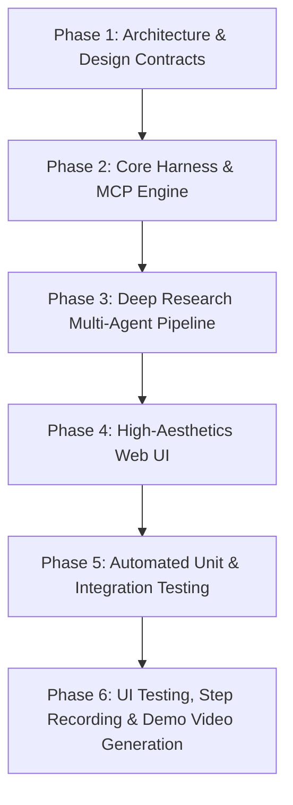

# Implementation Plan: Autonomous Deep Research Agent

## 1. Project Overview & Milestone Breakdown
This plan outlines the phase-by-phase implementation of the **Autonomous Deep Research Agent**, organizing the engineering execution across 6 structured phases.

---

## 2. Phase-by-Phase Roadmap

### Phase 1: Planning, Contracts & System Design
- **Deliverables**:
  - `prd.md` & `prd_review.md` (Completed)
  - `plan.md` & `plan_review.md` (Current)
  - `design.md` & `design_review.md` (Detailed UI/UX and System Architecture)
  - `test_cases.md` (Happy path and edge case test matrix)

### Phase 2: Core Harness & MCP Research Server
- **Deliverables**:
  - `deep_research_agent/engine/harness_stack.py`: Combines `LoopDetector`, `ContextTokenBudgeter`, `PathSanitizer`, and `EventLogger`.
  - `deep_research_agent/engine/guardrails.py`: Claude Code PascalCase `PreToolUse` hook contract, AST syntax parser, and regex secret scanner.
  - `deep_research_agent/engine/escalation_gateway.py`: 4-tier risk matrix and cryptographic `approvals.json` validator.
  - `deep_research_agent/engine/mcp_research_server.py`: Model Context Protocol server exposing `@mcp.tool()` search, scrape, and citation validation primitives.

### Phase 3: Multi-Agent Deep Research Pipeline (Compound Engine)
- **Deliverables**:
  - `deep_research_agent/engine/research_team.py`: Specialized Planner, Crawler/Implementer, Fact-Checker/Reviewer, and Synthesizer roles.
  - `deep_research_agent/engine/worktree_isolator.py`: Ephemeral git worktree isolation for crawling and evidence ingestion.
  - `deep_research_agent/engine/five_step_pipeline.py`: Coordinates the end-to-end 5-Step SOP (`Spec -> Sandbox -> Guardrails -> Pytest -> Final Review`).

### Phase 4: High-Aesthetics Web UI & API Server
- **Deliverables**:
  - `deep_research_agent/ui/index.html`: Semantic HTML5 single-page application with accessible tree views, citation grids, and dossier readers.
  - `deep_research_agent/ui/style.css`: Modern, responsive CSS using curated HSL color tokens, dark/light theme toggle, glassmorphism cards, and fluid grid layouts.
  - `deep_research_agent/ui/app.js`: Reactive frontend managing query submission, live research graph rendering, progress stepper, citation modal, and export actions.
  - `deep_research_agent/server.py`: Lightweight Python HTTP API server connecting frontend UI with the deep research harness engine.

### Phase 5: Comprehensive Automated Testing (Pytest)
- **Deliverables**:
  - `deep_research_agent/tests/test_happy_path.py`: Tests full query lifecycle, spec parsing, evidence gathering, citation verification, and markdown generation.
  - `deep_research_agent/tests/test_edge_cases.py`: Tests loop trap interception, directory traversal blocking, secret leak prevention, critical permission escalation rejection, and malformed queries.
  - `deep_research_agent/tests/test_mcp_harness.py`: Stdio MCP IPC protocol verification and resource caching checks.

### Phase 6: UI Testing, Step Recording & Demo Video Generation
- **Deliverables**:
  - Automated step-by-step UI test runner recording high-resolution frame screenshots.
  - Local neural TTS narration audio (`demo_narration.mp3`).
  - FFmpeg compilation into a professional 1-minute+ MP4 demo video: `deep_research_agent/demo/deep_research_agent_demo.mp4`.

---

## 3. Resource Allocation & Timeline
- **Execution Order**: Strictly sequential (`design.md` -> `design_review.md` -> `test_cases.md` -> Engine implementation -> UI implementation -> Tests execution -> Video generation).
- **Environment**: Standalone Python 3.13 + Edge-TTS + FFmpeg.
